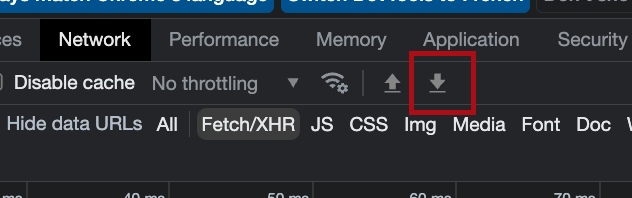

## UBER-EAT-ORDERS-RECAP

## SETUP:

 - login to https://www.ubeareats.com
 - go to https://www.ubereats.com/fr/orders
 - scroll up to bottom by pressing `see more`
  
  
 - once done, go to developer tools and download the har file   
  

## USAGE:

  ``$ yarn build``  
  ``$ yarn start ${filePath=./www.ubereats.com.har} ${startDateFilter=2000} ${topRange=3}``
